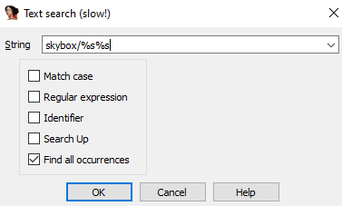
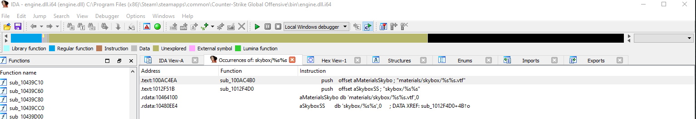
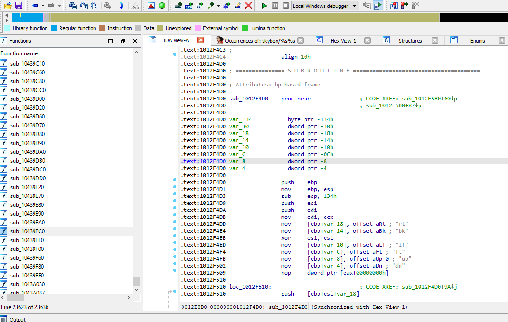

# csgo-load-named-sky
Quick Tutorial on how to call the function loadNamedSky() in csgo.

# Steps 
1. Open Ida
2. Search Strings for: 'skybox'
3. Find Function
4. Get Memory Location of Function
5. Define Function in C++ File
7. Call With Arguments

# Step 1
Open \Path_to_csgo\bin\engine.dll in Ida

# Step 2 
Search for: 'skybox' <br>


# Step 3
Find Function <br>


# Step 4
Get Memory Location of Function <br>


# Source Code
```C++
using tLoadNamedSky = void(__fastcall*)(const char*); // Create templete

bool loadNamedSky(const char* skyname) {
  uintptr_t engine = (uintptr_t)GetModuleHandle(L"engine.dll"); //Get Engine Handle
  if (engine == NULL || skyname == NULL) { return false; } // NULL Check
  const tLoadNamedSky loadNamedSky = (tLoadNamedSky)(engine + 0x12f4d0); 
  if (loadNamedSky == NULL) { return false; }
        loadNamedSky(skyname);
        return true;
 }
 int main() {
    loadNamedSky("vietnam");
 }
```
